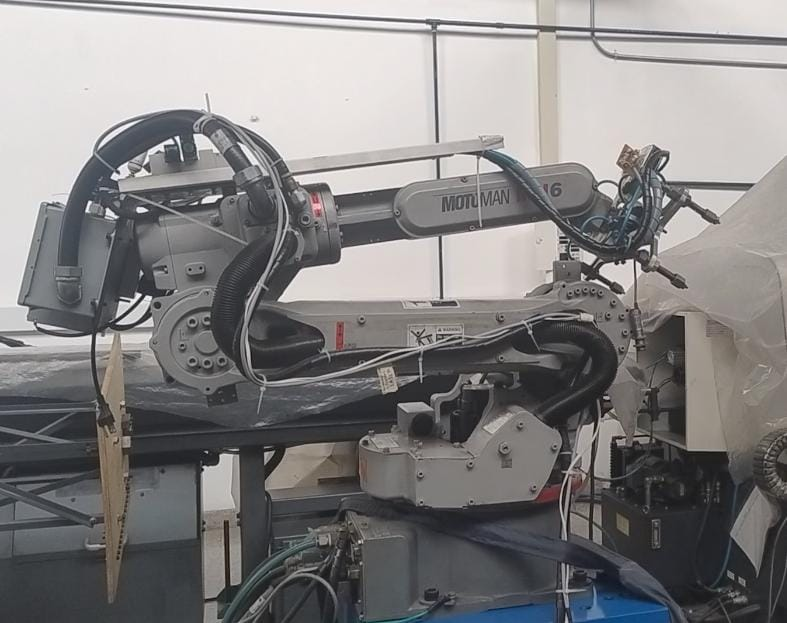
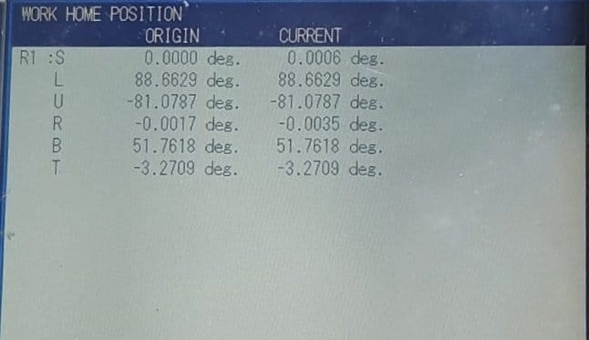
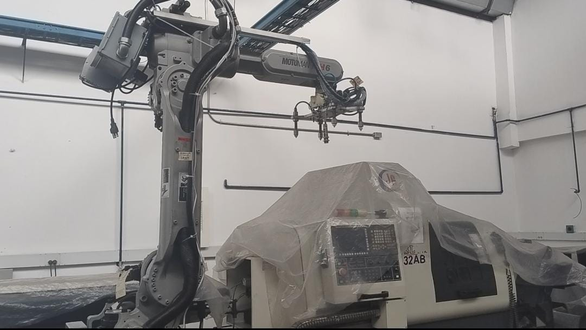
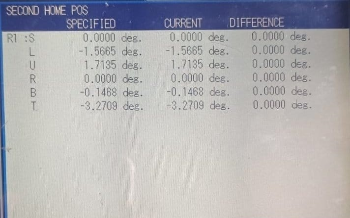
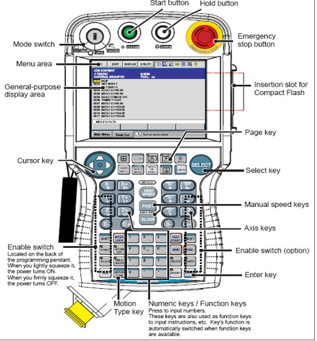
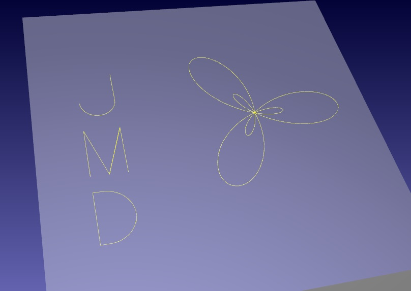
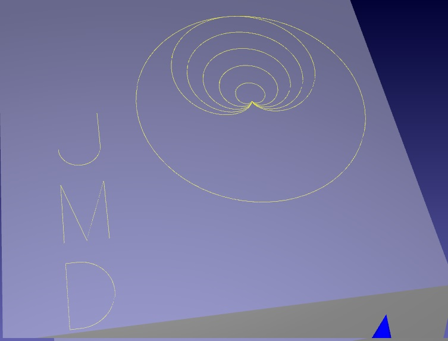

# Laboratorio No.03 Robóica Industrial - Análisis y Operación del Manipulador Motoman MH6.

# Integrantes:

* Juan Manuel Rojas Luna
* Miguel Ángel Ortiz Mejía
* Dixon Alberto Cuesta Segura

## Introducción.

El presente laboratorio tiene como propósito comparar las características técnicas de los manipuladores industriales como el Motoman MH6 de Yaskawa y el ABB IRB140, comprender y aplicar las configuraciones iniciales del Motoman MH6 (home1 y home2), explorar sus modos de operación manual (por articulaciones y cartesiano), y ajustar los niveles de velocidad para su manipulación segura. Además, se utilizará el software RoboDK para diseñar, simular y ejecutar una trayectoria en coordenadas polares, permitiendo observar la integración entre la programación offline y la operación física del robot. Este ejercicio busca fortalecer las competencias en el uso de herramientas digitales para programación de robots, así como la comprensión práctica de los fundamentos de control y operación de manipuladores industriales en entornos reales.

## Planteamiento del problema.

En la automatización industrial, el uso de manipuladores robóticos como el Motoman MH6 y el ABB IRB140 exige conocer sus diferencias técnicas, modos de operación y herramientas de programación. Sin este conocimiento, se dificulta la correcta selección, configuración y uso del robot según la tarea requerida. Además, la integración de entornos virtuales como RoboDK y RobotStudio plantea el reto de vincular simulaciones con la ejecución física de trayectorias. Esto requiere que los estudiantes desarrollen competencias prácticas que combinen análisis técnico, operación manual y programación eficiente del robot.

## Objetivos.

* Comparar las características técnicas del Motoman MH6 y del ABB IRB140, incluyendo aspectos como carga útil, alcance, velocidad, grados de libertad y aplicaciones típicas, a través de un cuadro comparativo detallado.

* Describir y diferenciar las configuraciones iniciales home1 y home2 del manipulador Motoman MH6.

* Ejecutar movimientos manuales en el manipulador, cambiando entre modos de operación (articulaciones, cartesiano) y aplicando traslaciones y rotaciones en los ejes X, Y y Z.

*  Detallar los niveles de velocidad disponibles para el movimiento manual del Motoman MH6, explicando cómo se realiza el cambio entre niveles y cómo se visualiza la velocidad seleccionada en la interfaz del controlador.
  
*   Describir las principales funciones del software RoboDK, su utilidad para programar y mover manipuladores industriales, y su forma de comunicación con el robot físico.

* Diseñar, simular y ejecutar una trayectoria polar en el entorno virtual de RoboDK y realizar su implementación física con el manipulador Motoman MH6.

## **Para la practica**

* **Software RobotDK instalado**
* **Robot  Motoman MH6**

### Descripcion premilinar del robot:

Para el desarrollo de esta laboratorio se  tiene  disponible  un sistema robótico compuesto por el robot Yaskawa Motoman MH6, incluyendo dos ejes externos: guía lineal y posicionador rotacional. En este caso unicamente se uso el robot Yaskawa Motoman MH6.
La siguiente tabla muestra las especificaciones del robot Motoman, según lo documentado por García Carrero (2017).

| Característica | Detalle / Eje | Valor |
| :--- | :--- | :--- |
| **Carga máxima** | | 6 kg |
| **Alcance vertical** | | 2486 mm |
| **Alcance horizontal**| | 1422 mm |
| **Repetibilidad** | | ± 0.08 mm |
| **Rango máximo de movimiento** | Eje - S | ±170° |
| | Eje - L | +155° / – 90° |
| | Eje - U | +250° / – 175° |
| | Eje - R | ±180° |
| | Eje - B | +225° / – 45° |
| | Eje - T | ±360° |
| **Máxima velocidad** | Eje - S | 220°/s |
| | Eje - L | 200°/s |
| | Eje - U | 220°/s |
| | Eje - R | 410°/s |
| | Eje - B | 410°/s |
| | Eje - T | 610°/s |

Como se mencionó anteriormente, el laboratorio cuenta además con la guía lineal TSL1000 de Yaskawa, un dispositivo fijado al suelo que permite desplazar el robot de forma lineal a lo largo de una distancia de hasta tres metros.

| | |
| :--- | :--- |
| **Carga máxima** | 1000 kg |
| **Desplazamiento** | 3000 mm |
| **Velocidad máxima**| 0.72 m/s |
| **Repetibilidad** | ± 0.05 mm |

Adiconalmente tambien se tiene el posicionador rotacional con estas caracteristicas
| | |
| :--- | :--- |
| **Rango de movimiento** |360°|
| **Velocidad máxima** | 1.2 rad/s |
| **Carga axial máxima**| 2500 N |
| **Carga radial máxima** | 1500 N|

### **1. Cuadro Comparativo: Motoman MH6 vs. ABB IRB140**

| Característica Técnica | Motoman MH6 | ABB IRB 140 |
| :--- | :--- | :--- |
| **Carga Máxima (Payload)** | *6 kg* | *6 kg* |
| **Alcance vertical** | *2486 mm* | *810 mm* |
| **Alcance horizontal** | 1422 mm | *810 mm* |
| **Número de Ejes** | *8* | *6* |
| **Repetibilidad** | *± 0.08 mm* | *± 0.03 mm* |
| **Peso del Robot** | 130 kg | *98 kg* |
| **Controlador** | *DX 100* | *IRC5* |
| **Protección (IP)** | IP54/67 | *IP67* |

### Tipos de montaje:

El manipulador Motoman MH6 puede instalarse en tres configuraciones físicas diferentes:

 1. Montaje en el suelo (Floor-mounted)
- Configuración estándar.
- El robot se fija directamente al suelo.
- No requiere ajustes especiales.

 2. Montaje en la pared (Wall-mounted)
- El robot se fija verticalmente sobre una pared.
- Requiere limitar el rango del eje S a ±30°.
- Se deben usar tornillos M16 con resistencia ≥1200 N/mm².
- Torque de apriete recomendado: 206 N·m.

 3. Montaje en el techo (Ceiling-mounted)
- El robot se instala colgado e invertido desde el techo.
- Requiere medidas de seguridad adicionales para evitar caídas.

 El ABB IRB140 permite múltiples ángulos de instalación gracias a la parametrización por gravedad (Gravity Alpha y Beta).

### Inclinación sobre el eje Y (Gravity Beta)
| Posición | Descripción                   | Ángulo |
|----------|-------------------------------|--------|
| 1        | Montaje en suelo              | 0°     |
| 2        | Inclinación hacia atrás       | 45°    |
| 3        | Montaje en pared vertical     | 90°    |
| 4        | Montaje suspendido (techo)    | 180°   |

### Inclinación sobre el eje X (Gravity Alpha)
| Posición | Descripción                   | Ángulo | Valor Alpha     |
|----------|-------------------------------|--------|------------------|
| 1        | Montaje en suelo              | 0°     | 0                |
| 2        | Inclinación 45° lateral       | 45°    | 0.785398         |
| 3        | Montaje en pared izquierda    | 90°    | 1.570796         |
| 4        | Montaje en pared derecha      | -90°   | -1.570796        |

Para montaje a 180°, se recomienda usar **Gravity Beta** en lugar de Gravity Alpha.

## **2. Posiciones "Home" del Motoman MH6**

La distinción entre `Home1` y `Home2` en un robot Motoman se refiere a posiciones de referencia predefinidas que cumplen diferentes propósitos para el operario y el sistema.

* **Home1 (Posición de Referencia Principal):**
    * **Descripción:** Esta posición es utilizada como referencia general para arranque del sistema, es la posición "cero" del robot. Es una posición conocida y calibrada de fábrica.
 

 

| Eje | Nombre                         | Ángulo Teach Pendant (°)| Ángulo aproximado (°) |
|-----|--------------------------------|-------------------------|------------------------|
| S   | Base (Shoulder)                | 0.0000                  | 0°                     |
| L   | Brazo inferior (Lower arm)     | 88.6629                 | 90°                    |
| U   | Brazo superior (Upper arm)     | -81.0787                | -80°                   |
| R   | Muñeca rotacional              | -0.0017                 | 0°                     |
| B   | Muñeca de flexión              | 51.7618                 | 52°                    |
| T   | Muñeca final                   | -3.2709                 | -3°                    |

    
 
* **Uso:** Se utiliza como punto de partida absoluto para la calibración, el mantenimiento y como una referencia segura y predecible a la que el robot puede volver.  
      

* **Home2 (Posición de Referencia Secundaria o de Usuario):**
  
    * **Descripción:** Es una posición "Home" definida por el usuario. Es la posición cero de los ejes, que es una ubicación conveniente y segura dentro del espacio de trabajo.

  
| Eje | Nombre                         | Ángulo Teach Pendant (°) | Ángulo aproximado (°)  |
|-----|--------------------------------|--------------------------|------------------------|
| S   | Base (Shoulder)                | 0.0000                   | 0°                     |
| L   | Brazo inferior (Lower arm)     | -1.5665                  | 0°                     |
| U   | Brazo superior (Upper arm)     | 1.7135                   | 0°                     |
| R   | Muñeca rotacional              | 0.0000                   | 0°                     |
| B   | Muñeca de flexión              | -0.1468                  | 0°                     |
| T   | Muñeca final                   | -3.2709                  | 0°                     |

   

* **Uso:** Se suele configurar como un punto de partida para una tarea específica, una posición de espera segura entre ciclos, o un punto intermedio para evitar colisiones antes de iniciar una trayectoria compleja. Ofrece flexibilidad para optimizar los ciclos de trabajo.

**¿Cuál posición es mejor?**

Desde el punto de vista operativo, Home2 es la posición más adecuada para la ejecución de procesos productivos. Esta configuración,  presenta ángulos articulares cercanos a cero, lo que posiciona al robot en una postura más extensa y alineada con el área de trabajo. Al estar más cerca del punto inicial de las trayectorias programadas reduce tiempos de desplazamiento. En cambio, Home1, aunque es la posición de fábrica, se utiliza principalmente para tareas de calibración, mantenimiento o reinicio seguro del sistema. 

### **3. Procedimiento detallado para ejecutar movimientos manuales, incluyendo el cambio entre los modos de operación (articulado y cartesiano), así como la realización de traslaciones y rotaciones en los ejes X, Y y Z**

Este procedimiento describe cómo operar manualmente el robot Motoman MH6 utilizando el Teach Pendant, permitiendo movimientos por articulaciones y en modo cartesiano, así como ajustes de velocidad y selección de ejes.

1. Encendido del robot

- Enciende el robot desde el panel de control.
- Asegúrate de que esté en **modo Teach**.

2.  Selección del modo de movimiento

El robot puede operarse manualmente en dos modos principales:

### Modo por articulaciones (Joint)

- Permite mover **una articulación a la vez**.
- Cada eje (S, L, U, R, B, T) se controla de forma independiente.

###  Modo cartesiano (XYZ)

- Permite mover el **Tool Center Point (TCP)** en el espacio tridimensional.
- Admite **traslaciones** en los ejes X, Y, Z y **rotaciones** sobre los ejes Rx, Ry, Rz.

3. Cambio entre modos de operación

- Pulsa el botón `COORD` en el Teach Pendant.
- Selecciona el sistema de coordenadas deseado:

| Modo     | Descripción                                  |
|----------|----------------------------------------------|
| `JOINT`  | Movimiento por articulaciones                |
| `WORLD`  | Coordenadas globales (referencia del robot)  |
| `TOOL`   | Coordenadas relativas al efector final (TCP) |
| `USER`   | Sistema definido por el usuario              |

4. Selección del eje o dirección de movimiento

Utiliza los botones del Teach Pendant para seleccionar el eje que deseas mover. Las direcciones pueden ser **positivas (+)** o **negativas (-)**.

**Movimiento Cartesiano**

| Movimiento | Acción                           |
|------------|----------------------------------|
| `+X / -X`  | Traslación adelante / atrás      |
| `+Y / -Y`  | Traslación lateral derecha / izq |
| `+Z / -Z`  | Movimiento vertical arriba / abajo |
| `+Rx / -Rx`| Rotación sobre eje X             |
| `+Ry / -Ry`| Rotación sobre eje Y             |
| `+Rz / -Rz`| Rotación sobre eje Z             |

**Movimiento articular**

| Movimiento | Acción                                 |
|------------|----------------------------------------|
| `+S / -S`  | Articulación S positivo y negativo     |
| `+L / -L`  | Articulación L positivo y negativo     |
| `+U / -U`  | Articulación U positivo y negativo     |
| `+R / -R ` | Articulación R positivo y negativo     |
| `+B  / -B `| Articulación B positivo y negativo     |
| `+T  / -T `| Articulación T positivo y negativo     |

Para habilitar el control conjunto del robot Motoman MH6 con un posicionador rotacional y una guía lineal TSL1000, es necesario configurar ambos dispositivos como ejes externos (external axes) dentro del sistema del controlador DX100. La guía lineal se integra como el séptimo eje, permitiendo el desplazamiento lineal del robot sobre una trayectoria recta de hasta tres metros, mientras que el posicionador rotacional se configura como el octavo eje, permitiendo la rotación precisa de piezas durante operaciones como soldadura o ensamblaje. Estos ejes pueden ser seleccionados manualmente desde el Teach Pendant utilizando los botones E+ y E-, y controlados con los mismos comandos de movimiento que los ejes principales del robot. Su configuración requiere definir parámetros como el tipo de eje, límites de movimiento, velocidad máxima, y relación con el sistema de coordenadas del robot, garantizando así una operación sincronizada y segura durante tareas automatizadas.

### **4. Niveles y Configuración de Velocidad Manual**

La velocidad en modo manual se ajusta para garantizar la seguridad del operario y la precisión del posicionamiento.

* **Niveles de Velocidad:**
    * El controlador del Motoman permite ajustar la velocidad de movimiento manual a través de porcentajes de la velocidad máxima. Generalmente se definen tres niveles:
        * **Baja (Low):** ~10%
        * **Media (Medium):** ~50%
        * **Alta (High):** hasta 100% de la velocidad manual permitida (que es inferior a la velocidad máxima en modo automático).

### **5. Aplicaciones y Comunicación de RoboDK**

RoboDK es una plataforma de simulación y programación offline para robots industriales, que permite diseñar, simular y controlar trayectorias sin necesidad de programar directamente en el controlador físico.

* **Aplicaciones Principales de RoboDK:**
  
    * **Simulación y Programación Fuera de Línea (Offline Programming - OLP):** Permite crear, simular y depurar programas de robot en un PC sin detener la producción.
    * **Simulación 3D de trayectorias:** Permite crear rutas complejas y visualizar cómo se moverá el robot en un entorno virtual antes de ejecutar el programa en el mundo real.
    * **Calibración de Robots:** Mejora la precisión del robot comparando el modelo virtual con el real.
    * **Conversión de Programas:** Convierte programas de un controlador de robot a otro.
    * **Mecanizado con Robots (CAM):** Genera trayectorias de robot a partir de modelos CAD/CAM para tareas como fresado, corte o impresión 3D.
    * **Validación de Celdas de Trabajo:** Permite diseñar y probar el layout de una celda robótica, verificar alcances y detectar colisiones.

* **¿Qué hace RoboDK para mover el manipulador? (Proceso de Comunicación)**
    1.  **Generación de Trayectoria:** El usuario crea o importa una trayectoria en el entorno 3D de RoboDK.
    2.  **Post-Procesamiento:** RoboDK utiliza un "post-procesador" específico para el controlador del robot (en este caso, un post-procesador para Motoman). Este componente traduce la trayectoria genérica de RoboDK al lenguaje de programación específico del robot (ej. JBI para Motoman).
    3.  **Transferencia de Archivo (Modo Offline):** El archivo de programa generado (.JBI) se transfiere al controlador del robot (vía USB, Ethernet) y se ejecuta localmente desde la Teach Pendant.
    4.  **Conexión Directa (Modo Online):** RoboDK se conecta directamente al controlador del robot a través de una conexión de red (Ethernet). Utiliza un "driver" para enviar comandos de movimiento en tiempo real. RoboDK lee la posición del robot virtual y envía pequeños incrementos de movimiento al robot real para que la siga, actuando como un "controlador remoto".

### **6. RoboDK vs. RobotStudio: Análisis Comparativo**

* **Diferencias y Usos Específicos:**

| Característica | RoboDK | RobotStudio |
| :--- | :--- | :--- |
| **Soporte de Marcas** | **Multi-marca.** Compatible con más de 50 marcas (Yaskawa, ABB, KUKA, Fanuc, etc.). | **Marca única.** Exclusivo para robots ABB. |
| **Enfoque Principal** | Simulación universal, programación offline (OLP) y conversión de programas. | Simulación de alta fidelidad, "gemelo digital" y programación avanzada de robots ABB. |
| **Interfaz y Curva de Aprendizaje**| Generalmente considerado más sencillo, ligero e intuitivo. | Más complejo y potente, con acceso a todas las funcionalidades específicas de ABB (ej. `RAPID`). |
| **Costo** | Modelo de licencia más accesible, con opciones perpetuas. | Generalmente más costoso y basado en suscripción. |
| **Uso Específico** | Ideal para integradores que trabajan con múltiples marcas de robots, educación, y aplicaciones rápidas de OLP. | Indispensable para desarrollar y depurar programas complejos para robots ABB, aprovechando todas sus capacidades específicas. |

* **¿Qué significa cada herramienta para usted? (Interpretación)**
    * **RoboDK:** Es una "navaja suiza" de la robótica. Su gran valor reside en la versatilidad y la interoperabilidad. Es la herramienta perfecta para un entorno donde coexisten diferentes tecnologías o para estandarizar la programación offline sin depender de un solo fabricante. Es sinónimo de flexibilidad y accesibilidad.
    * **RobotStudio:** Es el "entorno de desarrollo nativo" de ABB. Ofrece una simulación de máxima fidelidad (un verdadero gemelo digital) del robot y su controlador. Es la herramienta definitiva para sacar el máximo provecho a un robot ABB, permitiendo una programación detallada y una depuración precisa que garantiza que lo que se ve en la simulación es exactamente lo que ocurrirá en la realidad. Es sinónimo de precisión y especialización.

### **7. Programación de Trayectoria Polar en RoboDK**

El grupo desarrolló dos scripts en RoboDK programados en lenguaje Python, cada uno correspondiente a una trayectoria polar diferente diseñada para ser ejecutada por el robot Motoman MH6. Ambos programas integran, en el lado izquierdo de la trayectoria, la firma gráfica de las iniciales J, M, D, dispuestas en sentido vertical (de arriba hacia abajo), representando a los integrantes del equipo.

La primera trayectoria consiste en una rosa polar contenida dentro de otra rosa polar, generando un patrón geométrico complejo y estéticamente balanceado. La segunda trayectoria corresponde a un conjunto de cardioides de diferentes dimensiones, dispuestos de forma concéntrica o secuencial, todos contenidos dentro de una circunferencia principal.

* **Paso 1: Definir la Trayectoria Polar en RoboDK (Scripting)**
  * *Primera trayectoria*: Se genera una figura compuesta por una **rosa polar** —una curva matemática definida por la ecuación `r = B - A·sin(k·θ)`— seguida por las letras **J**, **M** y **D**, que representan las iniciales del grupo.

    En la simulación con **RoboDK**, la trayectoria se ejecuta correctamente:
    
    - Se conecta al robot virtual.
    - Se define un *frame* de trabajo y una herramienta activa.
    - Se configura una velocidad de **300 mm/s** y un *blending* suave con `setRounding(5)`.
    
    La trayectoria consta de:
    
    - **Rosa polar:** aproximada mediante **720 puntos**, todos trazados con `MoveL` para formar una curva suave.
    - **Letra J:** trazada mayormente con `MoveL` y un arco final generado con `MoveC`.
    - **Letra M:** compuesta enteramente con movimientos lineales `MoveL`.
    - **Letra D:** combina segmentos rectos con `MoveL` y una porción curva trazada con `MoveC`.

  *  *Segunda trayectoria*:
 
      Este script genera un patrón de **cardioides concéntricas** dentro de un círculo delimitador, seguido por el dibujo de las letras **J**, **M** y **D**.
  
    Cada cardioide se basa en la ecuación polar:

    `r = a(1 + cos(θ))`

    Donde `a` varía entre las curvas para formar múltiples cardioides desde el centro hacia afuera.  
El contorno del círculo delimitador se dibuja con `MoveL`, al igual que todos los puntos del patrón.

    - Se conecta al robot virtual desde RoboDK.
    - Se define un *frame* de trabajo llamado `"Frame_from_Target1"`.
    - Se configura una velocidad de **200 mm/s** y un *blending* con `setRounding(3)`.
    - Se dibujan:
      - **5 cardioides**, cada una con 360 puntos trazados con `MoveL`, desplazadas por un offset configurable (`offset_x`, `offset_y`).
    - Un **círculo contenedor** compuesto por 72 puntos para delimitar visualmente la zona de trabajo.
    - Las iniciales **J**, **M**, **D**: combinan movimientos lineales (`MoveL`) y curvos (`MoveC`) para representar las letras.
 
* **Paso 2: Ejecución Virtual en RoboDK**
    * Una vez que el script ha generado el programa con la secuencia de movimientos, ejecuta el programa en la simulación de RoboDK.
    * Verificamos  visualmente que la trayectoria sea correcta, que el robot no exceda los límites de sus ejes y que no haya colisiones.

* **Paso 3: Ejecución Física en el Motoman MH6 (Comandado desde PC)**
    1.  **Establecer Comunicación:** Hacemos ping para asegurar  de que el PC con RoboDK y el controlador del Motoman estén en la misma red Ethernet.
    2. **Configuramos el Controlador en modo romoto:**Se gira la llave del Teach Pendant  y ya se garantiza que podemos empezar aejecutar la rutina 

    4.  **Monitoreo:** RoboDK enviará los puntos de la trayectoria uno por uno al controlador del robot. El robot físico se moverá siguiendo la trayectoria simulada, mientras la simulación en RoboDK refleja el movimiento real del robot. Es crucial supervisar este proceso con el pulsador de emergencia ("E-Stop") a mano.

> [!IMPORTANT]
> El comando `MoveC` **no funciona en modo streaming** (tiempo real) con el robot Motoman MH6 debido a las **limitaciones del driver de RoboDK**.  
> Para que los movimientos circulares se ejecuten correctamente, se debe **generar un programa `.JBI` offline** y cargarlo directamente al controlador del robot.

 
 

Se adjuntan los archivos .rdk correspondientes a cada una de las trayectorias desarrolladas.

#### Rosa dentro de otra rosa.

#### Cardioide.

### 8. Videos.

Se adjuntan los videos correspondientes a cada una de las trayectorias desarrolladas. En cada video se puede observar de forma comparativa el movimiento simulado en RoboDK y la ejecución real del robot físico Motoman MH6.

#### Rosa dentro de otra rosa.

[Video_Rosa_Doble](https://youtu.be/4MjX-Fkn7r8)

#### Cardioide.

[Video_Cardioide](https://youtu.be/sA8mHKQvbHA)

# **Referencias**

* García Carrero, J. (2017). Planeación de trayectorias en vuelo de un manipulador industrial para el Laboratorio Fábrica Experimental UN.
* ABB (2003), *IRB 140 Industrial Robot - Datasheet*. ABB Robotics
